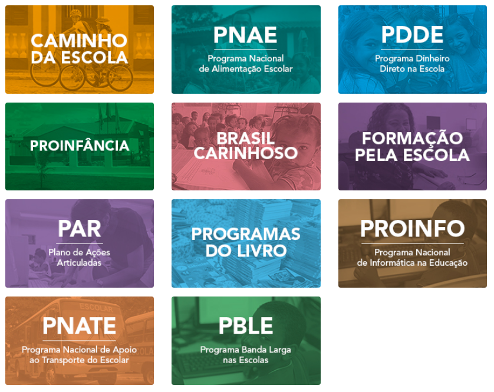
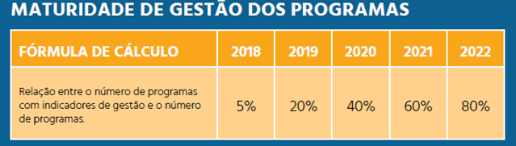

---
title       : Núcleo de Métodos Quantitativos (QUANT) - FNDE
subtitle    : Proposta inicial de estruturação e funcionamento
author      : Allan Quadros
job         : 
framework   : io2012        # {io2012, html5slides, shower, dzslides, ...}
highlighter : highlight.js  # {highlight.js, prettify, highlight}
hitheme     : tomorrow      # 
widgets     : [mathjax, quiz, bootstrap, interactive] # {mathjax, quiz, bootstrap}
ext_widgets : #{rCharts: [libraries/nvd3, libraries/leaflet, libraries/dygraphs]}
mode        : selfcontained # {standalone, draft}
knit        : slidify::knit2slides
logo        : fnde_blue.jpg
biglogo     : fnde_logo1.jpg
assets      : {assets: ../../assets}
--- .class #id

<style type="text/css">
body {background:grey transparent;
}
.quiz-option label{
  display: inline;
  font-size: 1em;
}
ul.nav li::before { content: ""; }  
ul.nav li{ font-size: 18px; line-height: 24px;}
</style>


## O FNDE ($)

```{r, echo=FALSE, warning=FALSE, cache=FALSE, results='asis'}
cat('<iframe src="./assets/widgets/plotly_orcamento.html" width="90%" height="50%" scrolling="no" seamless="seamless" frameBorder="1"> </iframe>')
```


--- .class #id
## O FNDE


  
- 
  
  


--- .segue bg:grey
# Como o FNDE manipula e utiliza esse grande volume de dados?


--- .segue bg:grey


--- .segue bg:grey


--- .segue bg:grey
 </br>

--- .segue bg:grey


<!-- --- .class #id -->
<!-- ## Exemplos (do que não fazer) -->

<!-- <br> -->

<!--  -->


<!-- --- .class #id -->
<!-- ## Exemplos (do que não fazer) -->

<!--  -->


<!-- --- &twocol -->
<!-- ## Exemplos (do que não fazer) -->
<!-- <br> -->
<!-- *** =left -->
<!-- > -  -->

<!-- > -  -->


<!-- *** =right -->

<!-- > -  -->


--- &twocol
## Resumo do Problema

*** =left
<br>
<br>
> + .fragment imensa quantidade de dados
<br>
<br>
> + .fragment dados extremamente sensíveis (financeiros, estratégicos)
<br>
<br>

*** =right
<br>
<br>
> + .fragment `análise de dados pouco profissional`
<br>
<br>
> + projeções equivocadas
> + indicadores inócuos/imprecisos
> + controles falhos
> + retrabalho
> + desperdício de tempo
> + desperdício de `$$$`


--- .segue bg:grey
# O Núcleo ...


--- .class #id
## Missão do Núcleo
<br>
Qual seria então o papel do Núcleo?

> .fragment `Tratar problemas` cuja origem ou solução estão em dados internos ou externos à autarquia e `produzir conhecimento` a partir destes dados de modo a contribuir para gestão estratégica dos programas educacionais.


--- .class #id
## Localização
<br>
<br>


--- .class #id
## Atuação do Núcleo
<br>
<br>
> - indicadores 
<br>
> - auxiliar na estruturação/organização/governança de dados 
<br>
> - modelagem estatística/matemática 
<br>
> - capacitação 
<br>
> - coordenação de parcerias técnicas 
<br>
> - otimização de rotinas e prototipação de soluções 


<!-- --- .class #id -->
<!-- ## Funcionamento -->
<!-- <br> -->
<!-- <br> -->
<!-- > - análise contínua de dados dos programas e formulação de indicadores -->
<!-- <br> -->
<!-- > - sistema de concorrência de demandas $\Rightarrow$ projetos estratégicos -->
<!--    + presidência -->
<!--    + diretorias/prospecção do Núcleo junto as áreas -->


--- .class #id
## Funcionamento
<br>
<br>
<video width="480" height="360" controls >
<source src="./assets/img/apres_nuqnt_rev4.mp4" type="video/mp4">
</video>


<!-- --- .class #id -->
<!-- ## Capacitação -->
<!-- <br> -->
<!-- <br> -->
<!-- > - rodadas de capacitação com as diretorias -->
<!--  + Análise de Dados introdutória -->
<!--  + R, Python & SQL -->
<!--  + Estatística Básica -->
  


--- &twocol
## Como o Núcleo pode ajudar?

*** =left

- 

- `ideia:` utilizar um modelo de regressão logística

- 


*** =right
<br>
<br>
<br>
<br>
<br>
<br>
<br>
<br>
> - Detectou inadimplentes em $\frac{3}{4}$ das vezes


--- &twocol
## Como o Núcleo pode ajudar?

*** =left

```{r, echo=FALSE, warning=FALSE, cache=FALSE, results='asis'}
cat('<iframe src="./assets/widgets/plotly_scatter1.html" width="90%" height="50%" scrolling="no" seamless="seamless" frameBorder="1"> </iframe>')
```

*** =right

```{r, echo=FALSE, warning=FALSE, cache=FALSE, results='asis'}
cat('<iframe src="./assets/widgets/plotly_scatter2.html" width="90%" height="50%" scrolling="no" seamless="seamless" frameBorder="1"> </iframe>')
```


--- .class #id
## Algumas iniciativas isoladas

<br>
<br>
> - Malha-Fina FNDE
<br>
> - FisFa - Fiscaliza Fatura FIES
<br>
> - Conferência da carteira de títulos do FIES
<br>
> - Projeções financeiras de arrecadação
<br>
> - App para controle orçamentário de emendas parlamentares na DIFIN
<br>
> - Robô para raspagem do Diário Oficial da União
<br>
> - Capacitação de servidores em Análise de Dados em R (2 módulos)
<br>
- Outras ...


--- &twocol
## FisFa - Fiscaliza Fatura FIES


*** =left

> - aplicativo para fiscalização das faturas dos AF do Fies

> - 3 contratos: 2 com CEF e 1 com BB

> - mensalmente: taxa de administração da carteira de financiamento

> - fatura + base de dados dos alunos (+ 1,7 milhão linhas cada)

> - valor anual total das faturas ultrapassa 1 bilhão de reais

> - antes: conferência pro-forma ("amostragem") sem base de referência MEC


*** =right

> - indagações constantes de TCU/CGU

> - Projeto FisFa estruturou base de dados do MEC

> - tempo de análise: de 2 semanas para < 1 minuto

> - confiabilidade/robustez

> - total de economia: > R$ 200 milhões

> - Programado em `R` internalizando as regras contratuais

> - 2 prêmios: CGU (2016) e ANGC (2018)


--- .class #id
## Cooperação Técnica & Parcerias

<div>
<p>


</p>
</div>

<br>
<br>
<br>

<div>
<p>

 


</p>
</div>


--- .class #id
## Outras atividades

<br>
<br>
> - Abrir os dados do FNDE para a comunidade acadêmica
<br>
<br>
<br>
> - Receber estudantes de pós-graduação e graduação


--- .segue bg:grey
# Obrigado.

<!-- como colocar figuras ao lado de palavras varias vezes em html -->
