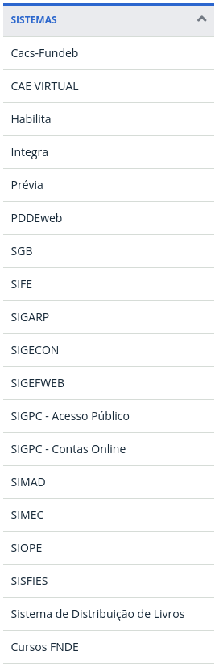
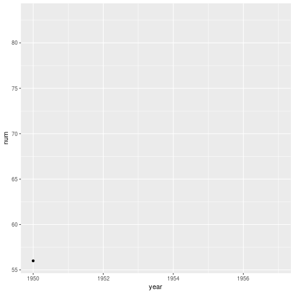

---
title       : Núcleo de Métodos Quantitativos (NUQNT) - FNDE
subtitle    : Proposta inicial de estruturação
author      : Allan Vieira
job         : 
framework   : io2012        # {io2012, html5slides, shower, dzslides, ...}
highlighter : highlight.js  # {highlight.js, prettify, highlight}
hitheme     : tomorrow      # 
widgets     : [mathjax, quiz, bootstrap, interactive] # {mathjax, quiz, bootstrap}
ext_widgets : #{rCharts: [libraries/nvd3, libraries/leaflet, libraries/dygraphs]}
mode        : selfcontained # {standalone, draft}
knit        : slidify::knit2slides
logo        : fnde_blue.jpg
biglogo     : fnde_logo1.jpg
assets      : {assets: ../../assets}
--- .class #id

<style type="text/css">
body {background:grey transparent;
}
.quiz-option label{
  display: inline;
  font-size: 1em;
}
ul.nav li::before { content: ""; }  
ul.nav li{ font-size: 18px; line-height: 24px;}
</style>


## O FNDE
<br>
<br>


  
- 
  
  


--- .class #id

> .fragment 


--- .class #id
## $$$




--- .segue bg:grey
# (Como) esses programas são avaliados em termos de eficiência, eficácia e efetividade?


--- .segue bg:grey
# Como o FNDE manipula o volume de dados gerados em cada um desses programas?


--- .class #id
## Excel

<br>
<br>
> + .fragment manipular pequena quantidade de dados;
<br>
<br>
> + `dados` $\rightarrow$ não demandam organização detalhada;
<br>
<br>
> + consultas/tarefas que não são repetidas com frequência;
<br>
<br>
> + contas e manipulações não muito sofisticadas;  

--- &twocol
## Resumo do Problema


*** =left
<br>
<br>
> + .fragment imensa quantidade de dados
<br>
<br>
> + .fragment dados extremamente sensíveis (financeiros, estratégicos, projeções)
<br>
<br>

*** =right
<br>
<br>
> + .fragment `análise de dados amadora`
<br>
<br>
> + projeções equivocadas
> + indicadores inócuos/imprecisos
> + controles falhos
> + retrabalho
> + desperdício de tempo
> + desperdício de `$$$`

--- .segue bg:grey
# O Núcleo ...

--- .class #id
## Missão do NMQ
<br>
Qual seria então o papel do Núcleo?

> .fragment `Solucionar problemas` cuja origem ou solução estão nos dados utilizados pela autarquia e `produzir insights` a partir destes dados de modo a reduzir gargalos, otimizar o trabalho, gerar economia de recursos financeiros e de tempo com o objetivo de aprimorar a gestão no âmbito das diretorias e dos programas da autarquia como um todo.

<br>
... contribuindo para que o FNDE ...
> .fragment `repassador de recursos` $\rightarrow$ `banco da educação` que contribui com a formulação da política 


--- .class #id
## Atuação do NMQ
<br>
<br>
- capacitação 
<br>
- estruturação/organização/governança de dados 
<br>
- modelagem estatística/matemática 
<br>
- automação 
<br>
- indicadores 

--- .class #id
## Funcionamento do NMQ
<br>
<br>
- recebimento/levantamento de demandas
<br>
- colocar animaçao do power point

--- .class #id
## Capacitação
<br>
<br>
- rodadas de capacitação
<br>
- colocar animaçao do power point

--- &twocol
## Parcerias Iniciais

*** =left

<br>
<br>
- ENAP
<br>
- Instituto de Matemática Pura e Aplicada (IMPA)
<br>
- Escola Nacional de Ciências Estatísticas (ENCE)
<br>
- EST-CIC/UnB
<br>
- $AI^2$ - SP

*** =left

<br>
<br>
- Abrir os dados do FNDE para a comunidade acadêmica
<br>
- Receber estudantes de pós-graduação e graduação (estágio)


--- .segue bg:grey
# Potencial do NMQ

--- .class #id
## Primeiros resultados
<br>
<br>
- Malha-Fina FNDE
<br>
- FisFa - Fiscaliza Fatura FIES
<br>
- Conferência da carteira de títulos do FIES
<br>
- Projeções financeiras de arrecadação na DIFIN
<br>
- Outras ...

--- .segue bg:grey
# Metodologia ...

--- .class #id
## Descrição geral do método

<br>
<br>
> - aplicar uma técnica de clusterização `(MST)` nos dados reais para $k=2,...,n$ $\space$ clusters;
> - obter duas estatísticas de teste (conectividade e SSwt) para cada solução;
> - repetir o procedimento para dados simulados (hipercubos);
> - comparar as soluções obtidas em ambos os casos para definir o valor de $k$;
<br>
> - `ideia` $\rightarrow$ espera-se que soluções espúrias de agrupamentos nos dados apresentem valores de estatísticas de teste próximos aos das simulações.


--- .class #id
## Minimum Spanning Trees (MST)

```{r, echo=FALSE, warning=FALSE, cache=FALSE, results='asis'}
cat('<iframe src="./assets/widgets/MST_intlink_plotly.html" width="100%" height="100%" scrolling="no" seamless="seamless" frameBorder="0"> </iframe>')
```


--- .class #id
## Hipercubos - Distribuição de Referência

inspiração: `Cubic Clustering Criterion (CCC)`

```{r, echo=FALSE, warning=FALSE, cache=FALSE, results='asis'}
cat('<iframe src="./assets/widgets/ccc_pca_plotly.html" width="100%" height="100%" scrolling="no" seamless="seamless" frameBorder="0"> </iframe>')
```


--- .class #id
## Estatísticas de Teste - SS.wt
<br>
<br>

- Soma de quadrados total intra-cluster:
  $$SS.wt = \sum_{i=1}^{k}SSw_i,$$
  
  onde $SSw_i$ é a soma de quadrados dentro do cluster $i$.

--- .class #id
## Estatísticas de Teste - conn

- $N$: número de pontos no dataset; 
- $L$ (ou $n\_neig$): cardinalidade do conjunto de vizinhos mais próximos para avaliar conectividade;
- $V_{L_{i}}$: conjunto de vizinhos mais próximos do ponto $i$; 
- $C_k$: conjunto (cluster) de pontos de rótulo $k$.


<br>

  $$conn = \sum_{i=1}^{N}\left(\sum_{j=1}^{L}x_{j,i}\right),$$
  
  $$x_{j,i} = \begin{cases} \frac{1}{j}, \; & \text{se} \; \nexists C_k: i \in C_k \land j \in C_k.  \\ 0, & \text{caso  contrário}. \end{cases}$$


--- .class #id
## Otimalidade de Pareto - Função Multi-objetivo


```{r, echo=FALSE, warning=FALSE, cache=FALSE, results='asis'}
cat('<iframe src="./assets/widgets/pareto_plotly.html" width=50% height=55% allowtransparency="true"> </iframe>')
```


--- .class #id
## Algoritmo (1)


```{r, echo=FALSE, warning=FALSE, cache=FALSE, results='asis'}
cat('<iframe src="./assets/widgets/algorit_plotly.html" width=50% height=55% allowtransparency="true"> </iframe>')
```


--- .class #id
## Algoritmo (2)


--- .segue bg:grey
# Uma demonstração ...


--- .segue bg:grey
# Alguns resultados ...


--- &twocol
## Resultados (1)

```{r echo=FALSE, results='asis', message=FALSE, warning=FALSE}

tab1 <- data.frame(
  id = c(1:4, paste0(5, letters[1:2]), 6:10, paste0(11, letters[1:3])),
  type = c(rep("elipse", 14)),
  dim = c(rep("2d", 8), rep("3d", 6)),
  N = c(66,236,30,100,1050,1050,620,750,315,520,633,383,383,383),
  n_neig = c(8,8,3,8,8,3,10,25,8,7,7,5,5,7),
  n_sim = c(100,400,400,100,100,400,1000,100,400,400,400,400,1000,1000),
  clust = c(3, rep(2,5), rep(3,3), rep(4,5)),
  result = c(paste0("k=",c(3,2,2,2,2,2)), "fail.MST", paste0("k=",c(3,3)), "fail.MST", "k=4", "k $\\ge$ 6", "k $\\ge$ 6", "k=4") 

)

tab2 <- data.frame(
  id = c(paste0(12, letters[1:2]), paste0(12, letters[1:2]), paste0(14, letters[1:2]), paste0(15, letters[1:4]), 16:18),
  type = c(rep("elipse", 2), rep("circ.+elip.", 4), rep("espiral", 5), "alongado", "along.+elip."),
  dim = c(rep("10d", 2), rep("2d", 11) ),
  N = c(838,838,550,550,1000,1000,1000,300,300,300,300,300,750),
  n_neig = c(3,7,7,25,25,10,7,20,15,15,20,30,25),
  n_sim = c(400,1000,1000,1000,400,1000,400,300,300,1000,300,300,100),
  clust = c(rep(4,2), rep(2,2), rep(4,2), rep(3,5), 4, 3),
  result = c("k $\\ge$ 5", "fail.MST", "k=4", "k=4", "k $\\ge$ 5", "k=5", "k=4", "k=2", "k=3", "k=3", "k=2", "k=4", "k=3") 

)


# tab1 <- tibble::as.tibble(tab[1:13,])
# tab2 <- tibble::as.tibble(tab[14:27,])
# 

library(kableExtra)
library(knitr)
library(dplyr)

                  
```


*** =left


```{r, results='asis', echo=FALSE}
tab1 %>%
  kable(format="html", escape=F, digits = 0) %>%
  kable_styling(bootstrap_options = c("striped", "hover"), full_width = F, font_size = 4) #%>%
```


*** =right


--- .class #id
## Resultados (2)
```{r, results='asis', echo=FALSE}
tab2 %>%
  kable(format="html", escape=F, digits = 0) %>%
  kable_styling(bootstrap_options = c("striped", "hover"), full_width = F, font_size = 4) #%>%
```


--- .class #id
## Resultados (3)

<!-- sol para imagens lado a lado: https://owlcation.com/stem/how-to-align-images-side-by-side -->


<p>


</p>


--- .class #id
## Resultados (4)

<p>


</p>


<p>


</p>

--- .class #id
## Resultados (5)

<p>


</p>

<p>


</p>


--- .class #id
## Conclusões

> - .fragment `MST:`
  - .fragment bom desempenho do algoritmo MST based clustering
  - .fragment `resolver problemas com outliers`

> - .fragment `Algoritmo geral:`
  - .fragment dificuldades em dados com grupos circulares (herda do ccc) e com outliers (herda do MST)
  - .fragment especificar `n_neig` é uma restrição
  - .fragment bom funcionamento no geral
  
> - .fragment `Para estudos futuros:`
  - .fragment aprimorar os algoritmos e implementar pacotes


--- .class #id
## Referências


- CURTIN, R. R. et al. `Mlpack: A scalable C++ machine learning library`. Journal of Machine Learning Research , v. 14, 2013.

- EVERITT, B. S. et al. `Cluster Analysis`. 5th edition. ed. [S.l.: s.n.], 2011.

- HANDL, J.; KNOWLES, J. `An evolutionary approach to objective clustering.` IEEE Transactions on Evolutionary Computation, v. 11, n. 1, Feb 2007. 2

- MARCH, W. B.; RAM, P.; GRAY, A. G. `Fast euclidian minimum spanning tree: algorithm analysis, and applications`. 16th ACM SIGKDD international conference on Knowledge discovery and data mining , July 25-28 2010. Washington, DC, USA.

- SARLE, W. S. `Cubic Clustering Criterion`. [S.l.], 1983. v. 46, n. A-108. Cary, NC.: SAS Institute, 1983, 56 pp.

--- .segue bg:grey

# Obrigado!!

<!-- como colocar figuras ao lado de palavras varias vezes em html -->
<div>
    <p>Feito no
     com 
    ,
     e
     !! </p>
</div>

Códigos e apresentação disponíveis noem:
<br>
<p>
<a href="http://github.com/allanvc/" style="color:black">http://github.com/allanvc/</a>
</p>

<p>
<a href="http://allanvc.github.io/apres_TCC2/" style="color:black">http://allanvc.github.io/apres_TCC2/</a>
</p>


